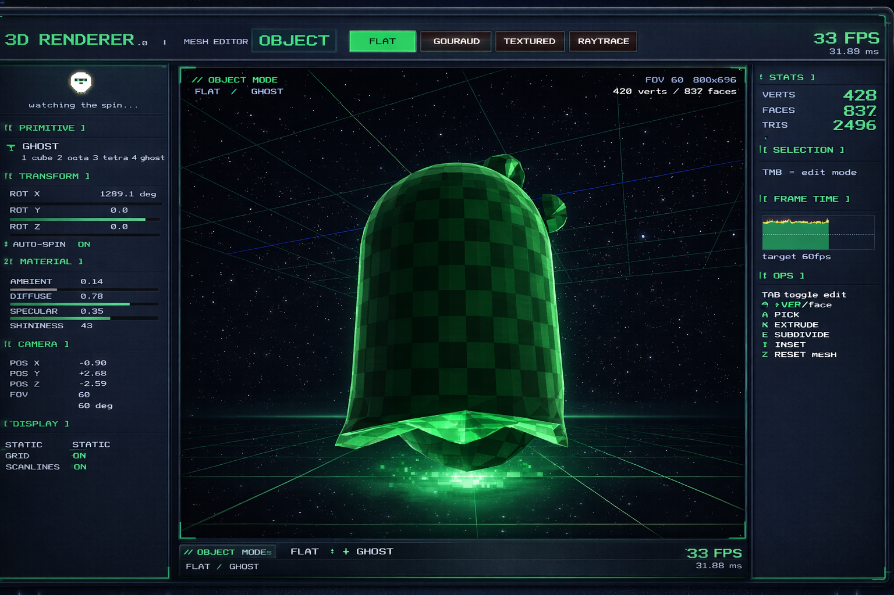

# 3D Renderer - Mesh Editor

A real-time 3D software renderer and mesh editor built from scratch in C++17 with SDL2. Features Blinn-Phong shading, progressive path tracing with atmospheric sky, procedural textures, and Blender-style mesh editing — all running on the CPU without a GPU.

## Mascot


## Renderer Example



## Features

- **Render Modes**: Wireframe, Flat, Gouraud (smooth Phong), and Path-Traced Raytracing
- **Mesh Editing**: Vertex/face selection, click-and-drag vertices, extrude, subdivide, inset
- **Primitives**: Cube, Octahedron, Tetrahedron, Ghost mascot
- **OBJ Import**: Drag and drop `.obj` files onto the window to load any model
- **Raytracing**: Progressive path tracer with BVH acceleration, Nishita atmospheric sky, shadow rays, Fresnel glass, metallic reflections
- **Materials**: Blinn-Phong BRDF, Lambertian diffuse, Metal, Dielectric (glass)
- **Lighting**: 3-point directional lighting, point lights, shadow rays
- **UI**: Animated splash screen, 4 color themes (Amber, Cyan, Magenta, Pro), pixel-art mascot, glassmorphism panels with depth effects

## Controls

| Key | Action |
|-----|--------|
| `1-3` | Switch primitive (Object mode) / render mode (Edit mode) |
| `4` | Ghost mascot primitive |
| `5` | Raytrace render mode (Edit mode) |
| `Tab` | Toggle Object / Edit mode |
| `V` / `F` | Vertex / Face select mode |
| `E` | Extrude selected face |
| `,` | Subdivide mesh |
| `Right-click drag` | Orbit camera |
| `Scroll` | Zoom in/out |
| `Left-click drag` | Drag vertices (Edit mode) |
| `T` | Cycle color theme |
| `L` | Toggle light rotation |
| `Space` | Toggle auto-spin |
| `R` | Reset camera |
| `G` | Toggle grid |
| `O` | Toggle scanlines |
| `Drag .obj file` | Load custom 3D model |

## Building

Requires CMake 3.16+, a C++17 compiler (MinGW-w64 or GCC), and SDL2.

```bash
./build.sh          # configure + build
./build.sh clean    # wipe build directory
```

The binary will be at `build/renderer_blueprint.exe`.

## Project Structure

```
3DRenderer/
├── src/
│   ├── core/           # vec.h, mat.h — vector and matrix math
│   ├── image/          # tgaimage.h/cpp — TGA framebuffer
│   ├── rasterizer/     # phong_shader.h, triangle.h, zbuffer.h
│   ├── raytracer/      # ray.h, renderer.h, material.h, sky.h, bvh.h
│   ├── scene/          # editable_mesh.h — mesh primitives + OBJ loader
│   ├── transform/      # transform.h — projection and viewport matrices
│   └── app/            # main_app_blueprint.cpp, app_blueprint.h, ui_effects.h
├── assets/             # ghost.obj model
├── images/             # Robot.png, Example.png
├── external/           # SDL2 (bundled)
├── CMakeLists.txt
├── build.sh
└── README.md
```

## License

MIT
